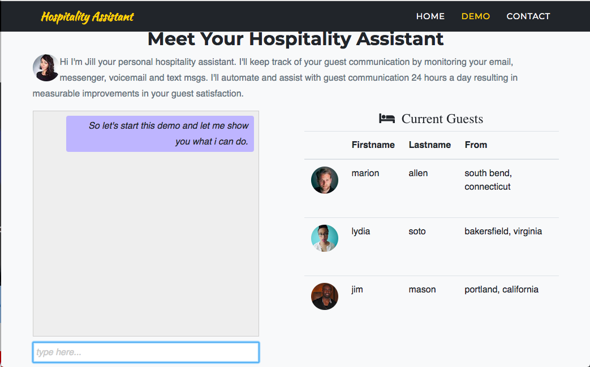
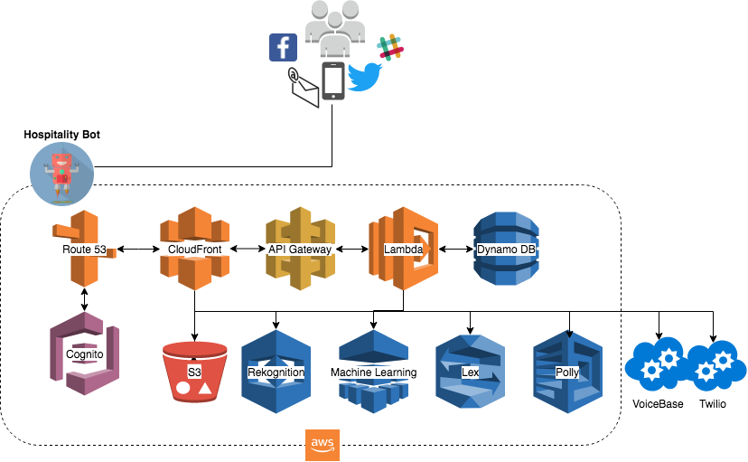

Hospitality Assistant
=
Conversational app (bot) for hosts to improve their communication with guests.
- sounds nice, show me a
[DEMO](http://bit.ly/2hdVxfn) first.

### Summary
 This project focuses on the hospitality industry and introduces the Hospitality Assistant. As communication channels continue to grow (voice, text, messaging, social), the Hospitality Assistant will assist in keeping up, managing, prioritizing and drawing insights from all your guest communication.

 The Hospitality Assistant will utilize machine learning, natural language understanding and speech technology using leading edge cloud services including [AWS](https://aws.amazon.com/amazon-ai/), [Google](https://ai.google/), [VoiceBase](https://www.voicebase.com/), [Twilio](https://www.twilio.com/)  to assist and automate practical use cases. The overall goal is to improve communication between host and guest.


* [Architecture](#architecture)
* [User Stories](#user-stories)
* [Installation](#installation)
* [Sample App](#sample-app)

### Architecture

* AWS Lambda and S3 serverless architecture
* NoSQL DynamoDB
* AWS Cognito authentication
* AWS Lex  conversational speech and text services
* Twilio voice and texting services
* Voicebase recording and speech analytics


### User Stories
* __Story 1 High Alert__   <p> As a host, get notified by the Assistant when urgent voice or text msgs need immediate attention in order to respond quickly. The Assistant will make judgements based on data from voice msgs, text msgs, guest profile and guest history.
* __Story 2 Compliance__ <p> As a host, get notified when any communication is out of compliance and get information on current standards and what you can and should not say or write to a guest. The Assistant can be configured to alert any party interested in communication compliance violations.
* __Story 3 Listing Quality__  <p> As a host, maintain quality listings by enabling the Assistant to monitor changes in your rental listings and rate and make suggestions such as 'these photos could use more brightness and color' and 'you seem to be missing photos of your kitchen and master bathroom'.
* __Story 4 Communication Review__ <p> As a host, ask the Assistant for a communication review and see a monthly summary of all your voice and text communication with ratings and how you compare to other hosts including suggestions on how to improve.
* __Story 5 Smart Auto Response__ <p> As a host, configure templates for the Assistant to send automated text responses in order to maintain a high response rate for common questions and requests. The Assistant will detect a request for 'local restaurants' from a guest whose first language is Japanese and include a Japanese translation of the local information guide.

### Installation
Install via git clone

```bash
$ git clone https://github.com/github4doug/hospitality-assistant.git
$ cd hospitality-assistant
$ npm install
$ npm start
```
### Sample App
It is still early days. However you can get an idea of what's coming down the road by [launching the latest demo](http://bit.ly/2hdVxfn).
